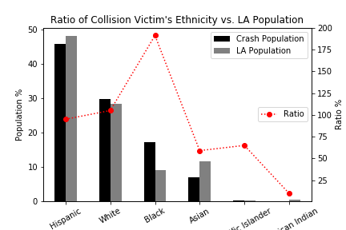
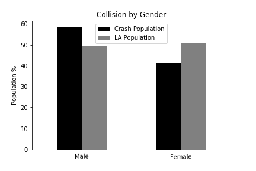
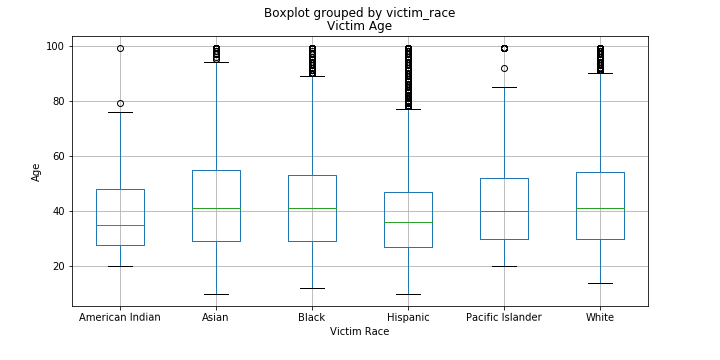
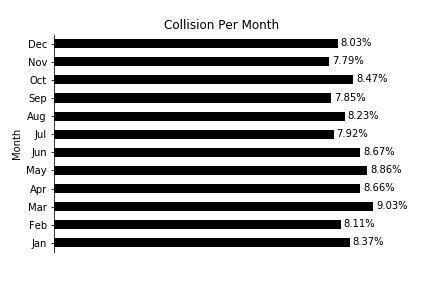
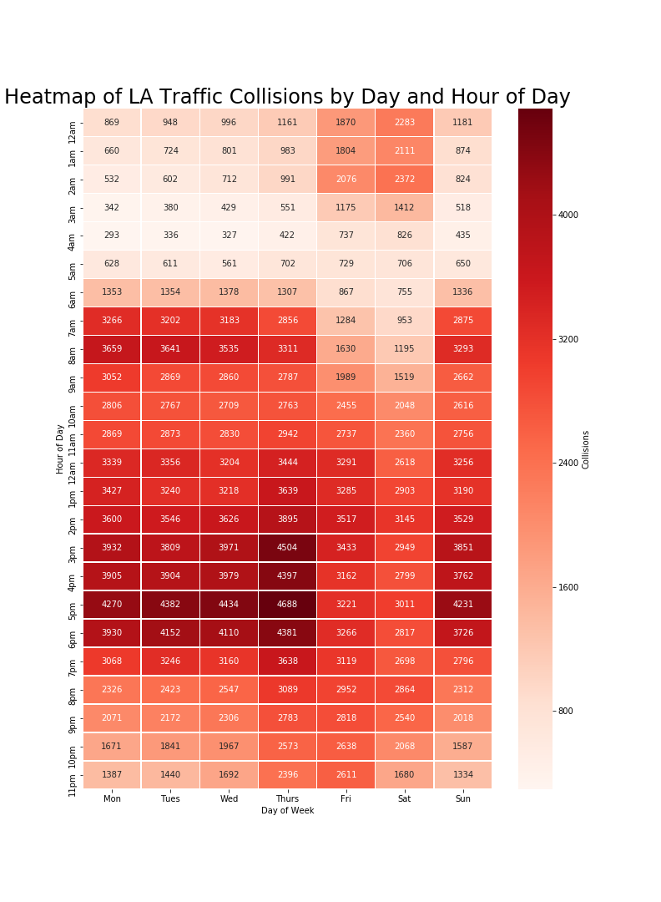
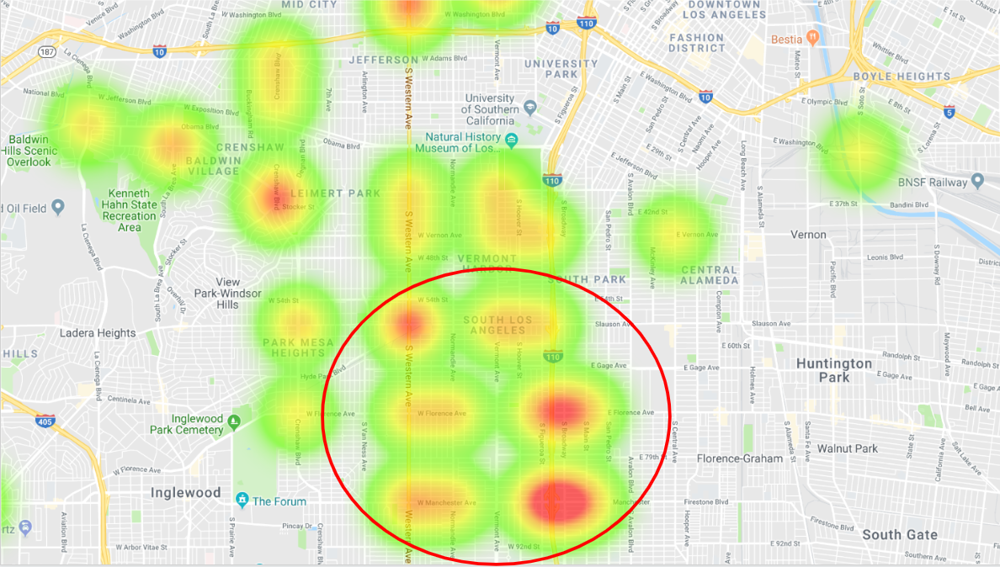

# **TRAFFIC ANALYSIS  REPORT** 

							by
							
					   Amairani Garcia, Christian Bourdeau, Shan Huang

# PROJECT DESCRIPTION:

Research of traffic collisions for the City of Los Angeles from 2010 to 2019 and create data visualizations using the records from the dataset. 

# Analysis Overview:

+ **Who? The demographic distribution of collision victims**

+ **When? The time distribution of collisions**

+ **Where? The relationship of location in which collisions occured**

# Technology Used

| Technology   		| Description    							|
| :---         		|     :---:      							|
|  Github      		| HTML, CSS, AWS 							|
|  API's       		| data.lacity.org, google 							|
|  Python Libraries   	| Python, Pandas, Matplotlib, Seaborn, scipy.stats, numpy, seaborn, gmap    		|
|  Supporting functions	| Sodapy (library), datecal, datetime, calendar, Rise (library)		|

# Development Overview		
		
+	Used Pandas to clean and format the dataset. 
+	Created a Jupyter Notebook describing the data exploration and cleanup process.
+	Created another Jupyter Notebook to illustrate the final data analysis. 
+	Used Matplotlib to create visualizations to answer questions inregards to the data.  
+	Used LA City API to gather real time crash data. 

		
